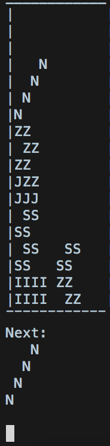
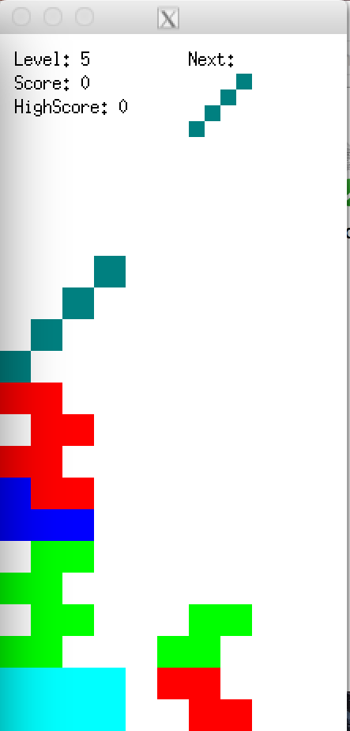

# Quadris

The game of Tetris is an implementation of the popular Game of Tetris. This project was done in C++ in a group of 2. The game an be played both in text as well as graphical mode

### Screenshots

